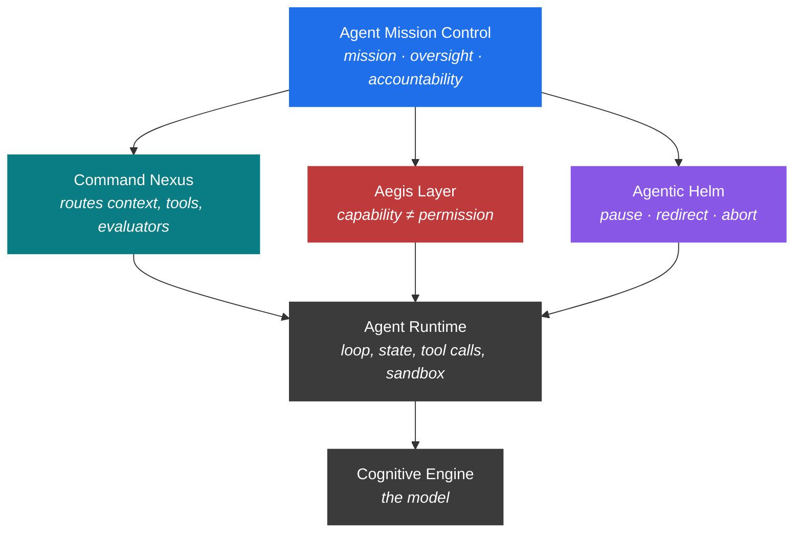

<div align="center">

# Agent Mission Control

**An operational vocabulary for the software that surrounds an AI agent.**

*Because calling an air traffic control tower a "seatbelt" shapes what you build next.*

[](./Agent%20Mission%20Control.md)
[](#changelog)
[](https://creativecommons.org/licenses/by/4.0/)

</div>

---

> *"The name decides where engineers look for responsibility. If we call it a harness, we look for straps."*

---

## TL;DR

We have been calling the software around an AI agent a **harness**. That word fit when an agent was a prompt, a loop, and three tools. It no longer fits.

The outer layer of a working agent system today does mission planning, routing, policy enforcement, telemetry, evaluation, correction, and human escalation. That is not a strap. It is **Mission Control** — and that is the metaphor this repository asks you to take seriously.

Three working role names fall out of it:

| Role | Concern | One-line test |
|---|---|---|
| **Command Nexus** | Routing & coordination | *Does it choose the next move, or merely execute one?* |
| **Aegis Layer** | Policy & protection | *Does it have authority to refuse, or only to warn?* |
| **Agentic Helm** | Steering & operator control | *Can a human pause, redirect, or abort a run in flight?* |

The full essay lives in **[Agent Mission Control.md](./Agent%20Mission%20Control.md)**.

---

## The shape of the argument



---

## Why a vocabulary matters

A working agent system today looks more like:

> a model, a runtime that turns outputs into actions, a memory that survives between steps, a policy layer with authority to refuse, an evaluation pass, and an operator who can stop the run.

…than like a model with a prompt. The outer layer chooses what the agent sees, decides which tools exist, limits which actions execute, runs tests against outputs, records traces, escalates to humans, aborts, retries, and updates memory. It decides — every few seconds — whether the next token becomes a side effect.

A name that calls all of that *a harness* is not wrong so much as **small**. It points engineering at straps when the discipline that already solved this class of problem was mainframe operations: job control, audit logs, an operator who could kill a run, a queue with priorities, a permission system that distinguished a user from the system account. Agents bring the operational profile back — expensive, multi-tenant, consequential — and the control surface deserves the same seriousness.

---

## What this repository is

A short, opinionated essay arguing for a vocabulary, and the three role names that fall out of it. It is not a framework, not a library, and not a manifesto for a Tool You Should Adopt By Friday. The labels (*Command Nexus*, *Aegis Layer*, *Agentic Helm*) are working names, not brands — keep them, replace them, refine them, but keep the distinctions they mark.

What this repository is **not**:

- a vendor checklist
- an argument for a single all-knowing controller (see §4 of the essay on why *Agent Master Control* is the wrong shape)
- a claim of priority — these ideas are in the air; the contribution is the framing

---

## Three questions for Monday morning

Borrowed from the essay's closing section. Open the architecture diagram, runbook, or `AGENTS.md` for an agent system currently in production, find the box labelled *harness* / *orchestration* / *agent framework*, and ask:

1. **Mission.** Where is the mission written down in a form a reviewer can check, and which file owns it?
2. **Authority.** Where, in code, does the boundary between what the model may *draft* and what the runtime may *execute* live? Which on-call engineer is paged when that boundary denies an action in production?
3. **Interruption.** Which control surface lets a human pause, redirect, or abort a run already in flight? And what is the measured latency from operator intent to runtime effect?

If the answers live in prompts, comments, Slack threads, or institutional memory rather than in code paths, deployment manifests, and pager rotations — the system has a harness, not Mission Control.

---

## Prior art and adjacent work

This piece sits next to, and quietly disagrees with, a number of others. Read them:

- **Anthropic** on agentic systems and *computer use* — where the word *harness* gets most of its current weight.
- **OpenAI Agents SDK**, **LangGraph**, **AutoGen**, **CrewAI** — frameworks that occupy parts of the Command Nexus role without naming the larger control surface.
- **Temporal**, **Airflow**, **Prefect** — deterministic workflow engines; useful substrate, but they assume the graph the Nexus must *choose* at runtime.
- **OPA (Rego) / Cedar** — policy engines that can serve as honest building blocks for an Aegis Layer, given an integration that gives them authority over actions rather than only over text.
- **OpenTelemetry**, **Langfuse**, **Arize Phoenix**, **Helicone** — telemetry that a Helm needs but cannot, by itself, become.
- **`AGENTS.md`**, as it appears in this repo and a handful of others — a mission file at rest; necessary, not sufficient.

If a piece belongs on this list and isn't, open a PR.

---

## Reading the essay

- **Single page:** [Agent Mission Control.md](./Agent%20Mission%20Control.md)
- **Length:** ~1,600 words / ~8 minutes
- **Tone:** essayistic, not specification

A short companion note, **[Aimergence.md](./Aimergence.md)**, sketches a related idea.

---

## The starter kit

Alongside the essay, this repository ships a small, copyable **starter kit**: the
minimum scaffolding needed to give an AI coding assistant a mission file, a set
of rules, a docs surface, and a validation gate it cannot skip. It is not the
Mission Control described in the essay — it is the on-ramp: the smallest
artifact-level shape that makes the three roles (Nexus, Aegis, Helm) something
you can point at in a real repo.

Drop it into any project and a fresh agent session has somewhere to read,
somewhere to write, and a single command that decides whether work is done.

### What's in the kit

| Path | Role | Maps to |
|---|---|---|
| [START_HERE.md](./START_HERE.md) | Three-step bootstrap (audit → copy → fill docs) | operator entry point |
| [AGENTS.md](./AGENTS.md) | Mission, work rules, failure policy, handoff format the agent reads every session | mission file (Helm input) |
| [docs/ARCHITECTURE.md](./docs/ARCHITECTURE.md) · [PRODUCT.md](./docs/PRODUCT.md) · [QUALITY.md](./docs/QUALITY.md) · [CONSTRAINTS.md](./docs/CONSTRAINTS.md) | Stubs the agent fills on first run, then a human confirms | mission context |
| [docs/DECISIONS.md](./docs/DECISIONS.md) · [KNOWN_FAILURES.md](./docs/KNOWN_FAILURES.md) | Append-only ledgers — non-obvious decisions, repeated agent mistakes | institutional memory |
| [scripts/validate-agent-work](./scripts/validate-agent-work) | The single "done" sensor; refuses to pass until at least one real check is wired | Aegis (artifact-level) |
| [scripts/bump-version.sh](./scripts/bump-version.sh) · [.version](./.version) | One source of truth for semver | release plumbing |
| [tickets/TICKET_TEMPLATE.md](./tickets/TICKET_TEMPLATE.md) | Per-task brief: goal, acceptance criteria, in/out of scope | mission, scoped to one run |

### How it's meant to be used

```bash
# 1. Audit an existing codebase first (read-only prompt in START_HERE.md Step 0)

# 2. Clone the repo, then copy the kit into your project root
#    (excluding this repo's own git history and prose).
git clone https://github.com/<owner>/agent-mission-control
cd agent-mission-control
rsync -av \
  --exclude='.git' \
  --exclude='README.md' \
  --exclude='Agent Mission Control.md' \
  --exclude='Aimergence.md' \
  ./ /path/to/your/project/

# 3. Open a fresh agent session, paste the bootstrap prompt from START_HERE.md
#    The agent fills docs/ from evidence; you confirm and fill REQUIRES HUMAN INPUT.

# 4. For each task: fill a ticket, hand the agent (ticket + AGENTS.md + docs/),
#    let it run validation, review the handoff.
./scripts/validate-agent-work
```

The kit is deliberately small — six docs, two scripts, one ticket template, one
version file. It does not replace a Command Nexus, a real Aegis Layer, or a
Helm; it is the *artifact-level minimum* the essay's principles imply.

**The kit ships the shape, not the teeth.** `validate-agent-work` ships with
`CHECKS_WIRED=false` and refuses to pass until you uncomment at least one real
check (linter, type checker, tests, build) for your project's toolchain. Until
wired, it is a placeholder, not an Aegis. The essay argues that an Aegis that
only warns is not Mission Control; the kit makes that contradiction loud on
purpose, so a fresh project cannot pretend the gate is real before it is. See
`START_HERE.md` Step 2.

---

## Contributing

Issues and pull requests are welcome, in roughly this order of usefulness:

1. **Counter-examples.** A system you would call Mission Control that the essay's definition fails to describe — or vice versa.
2. **Sharper distinctions.** Where the line between *Command Nexus* and *Agent Runtime* blurs in real systems.
3. **Better names.** The three role labels are deliberately provisional. Argue them down.
4. **Translations.** Welcome in any language; I can review German and English directly and will rely on contributors for the rest.
5. **Typos and prose.** Always.

Please keep PRs focused; the essay tries to earn every paragraph and prefers cuts to additions.

---

## Citation

If you reference this in a talk, post, or paper:

```bibtex
@misc{agent_mission_control_2026,
  title  = {Agent Mission Control: an operational vocabulary for the software around an AI agent},
  author = {Aranda Moeller},
  year   = {2026},
  howpublished = {\url{https://github.com/<owner>/agent-mission-control}},
  note   = {Essay}
}
```

Plain text:

> Moeller, Aranda. *Agent Mission Control: an operational vocabulary for the software around an AI agent.* 2026. https://github.com/&lt;owner&gt;/agent-mission-control

> **Before publishing:** replace `<owner>` in both citations above with the real GitHub owner, and confirm the author name is the one you want on this artifact in perpetuity.

---

## License

Prose is released under **[Creative Commons Attribution 4.0](https://creativecommons.org/licenses/by/4.0/)**.   
Quote it, remix it, disagree with it in print — attribution is the only ask.

Any code added later (examples, diagrams-as-code, reference implementations) will be **MIT** unless noted.

---

<div align="center">

*If your agent system can only be stopped by killing the process,*   
*it has not been designed to be stopped.*

</div>
